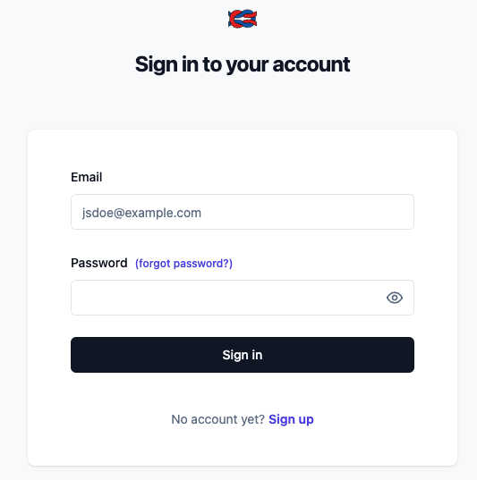
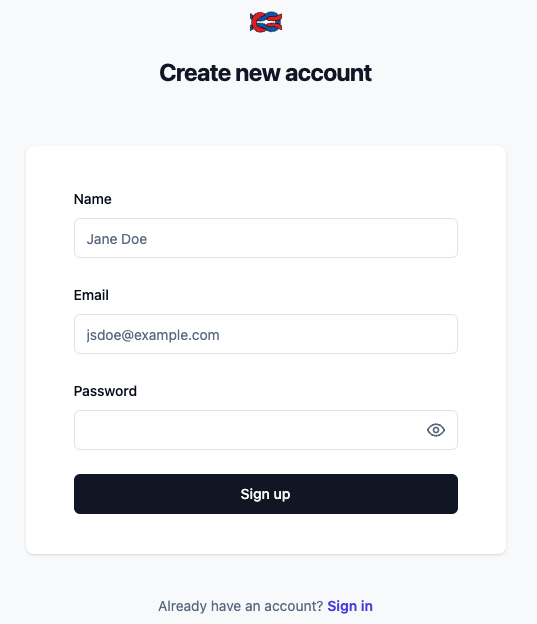
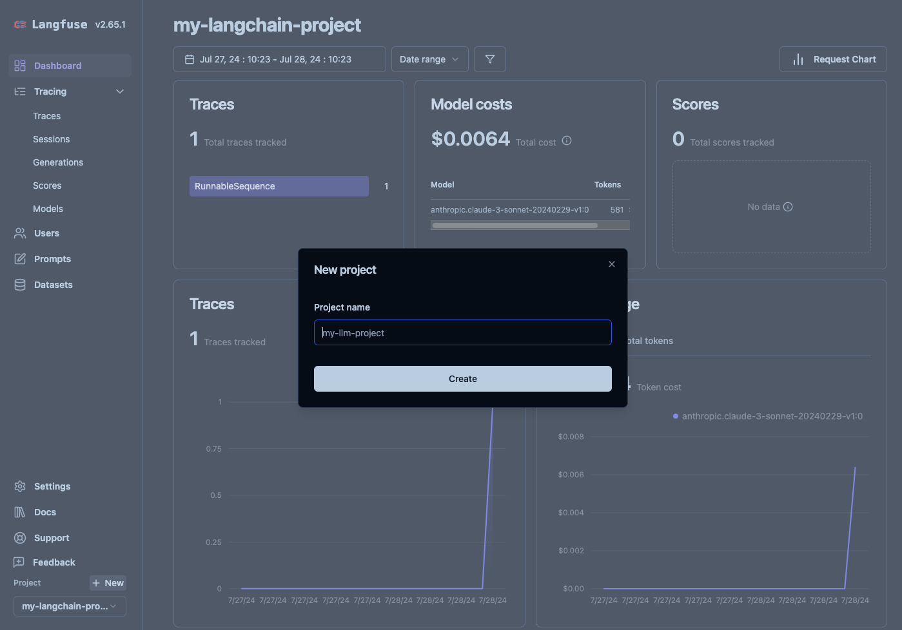
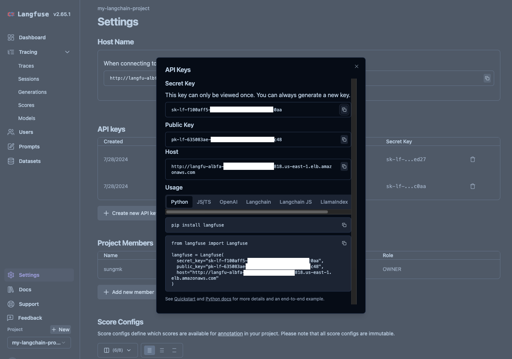
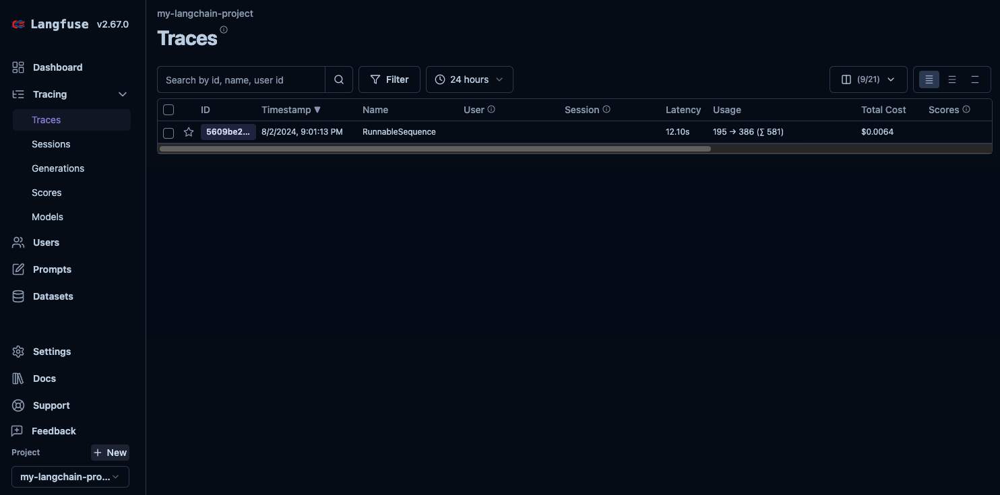
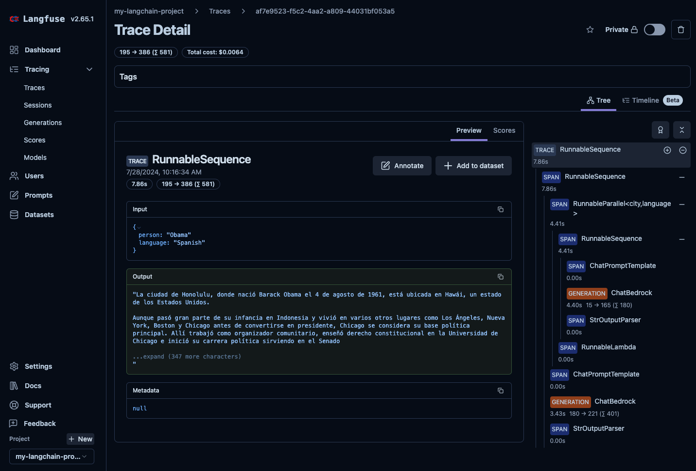

# Hosting Langfuse V3 on Amazon ECS with Fargate using CDK Python

This repository contains [AWS CDK](https://docs.aws.amazon.com/cdk/v2/guide/home.html) Python code for deploying the [Langfuse](https://langfuse.com/) application using Amazon Elastic Container Registry (ECR) and Amazon Elastic Container Service (ECS).

Langfuse is an open-source LLM engineering platform that helps teams collaboratively debug, analyze, and iterate on their LLM applications.


> :information_source: For more information on Langfuse's architecture, please check [the official documentation](https://langfuse.com/self-hosting#architecture)


## Deployment

### Quick start

If you don't have CDK development tooling set up already, and would just like to deploy the solution with the default settings - you can use the [AWS CloudFormation](https://docs.aws.amazon.com/AWSCloudFormation/latest/UserGuide/Welcome.html) template in [cfn_bootstrap.yml](./cfn_bootstrap.yml) by clicking the button below:

[](https://console.aws.amazon.com/cloudformation/home?#/stacks/create/review?templateURL=https://ws-assets-prod-iad-r-iad-ed304a55c2ca1aee.s3.us-east-1.amazonaws.com/ab6c96d3-53cf-4730-b0fe-f4762dbbb6eb/TODO-UPLOAD.yaml&stackName=LangfuseBootstrap "Launch Stack")

Alternatively, open the [CloudFormation Console](https://console.aws.amazon.com/cloudformation/home?#/stacks/create) in your target AWS Account and Region, click **Create stack**, and upload the [cfn_bootstrap.yml](./cfn_bootstrap.yml) template file.

This "bootstrap" stack sets up a CI project in [AWS CodeBuild](https://docs.aws.amazon.com/codebuild/latest/userguide/welcome.html) which pulls the sample code and performs the below CDK setup steps for you automatically in the Cloud - with no local development environment required. ⚠️ **Note** though, that the CodeBuild project is granted *broad permissions* to deploy all the sample's AWS resources on your behalf - so is not recommended for use in production environments as-is.


### Development setup

If you want to customize the solution, you'll likely need to set up your local development environment rather than using the quick-start template above.

#### Docker, Finch, etc

This project requires a local container build environment. If your organization doesn't support [Docker Desktop](https://www.docker.com/products/docker-desktop/), you can instead install [Finch](https://runfinch.com/). If using Finch instead of Docker, remember to:

- Initialise the VM with `finch vm start`, and
- Tell CDK how to build containers, by running `export CDK_DOCKER=finch` (on MacOS/Linux), or `SET CDK_DOCKER=finch` (on Windows)

#### NodeJS and CDK CLI

You'll need the [AWS CDK CLI](https://docs.aws.amazon.com/cdk/v2/guide/getting_started.html) installed, which depends on [NodeJS](https://nodejs.org/en). You can either install the CDK CLI globally (`-g`) as suggested in the developer guide, or just run `npm install` in this folder to use the local version specified in this project's `package.json`.

If you install the local project-specific CDK CLI version, you'll need to replace `cdk` in commands below with `npx cdk`.

#### Python and dependencies

The main infrastructure code for this project is written in [Python](https://www.python.org/) (3.10+, assuming a `python3` executable on your system path, or `python` on Windows), and you should use a Python *virtual enironment* to install the project dependencies.

To get started from your system terminal:

```bash
$ git clone --depth=1 https://github.com/aws-samples/deploy-langfuse-on-ecs-with-fargate.git
$ cd deploy-langfuse-on-ecs-with-fargate
$ git sparse-checkout init --cone
$ git sparse-checkout set langfuse-v3
$ cd langfuse-v3
```

Create the virtual environment:

```bash
$ python3 -m venv .venv
```

Activate the virtual environment on MacOS/Linux:

```bash
$ source .venv/bin/activate
```

...or on Windows:

```
% .venv\Scripts\activate.bat
```

**With your virtual environment activated**, install the project's dependencies:

```bash
(.venv) $ pip install -r requirements.txt
```

> To add additional dependencies, for example other CDK libraries, just add
them to your `requirements.txt` file and re-run the
`pip install -r requirements.txt` command.


#### Review solution configuration

Once your tools are set up, check the `context` configuration in `cdk.json`.
This contains a range of settings for the solution including things like
container image versions, and environmental variables for Langfuse components
- which you may want to customize before deployment.

For example,

```json
{
  "context": {
    "private_dns_namespace_name": "langfuse.local",
    "db_cluster_name": "langfuse-db",
    "ecr": [
      {
        "repository_name": "langfuse-web",
        "docker_image_name": "langfuse/langfuse",
        "tag": "3"
      },
      {
        "repository_name": "langfuse-worker",
        "docker_image_name": "langfuse/langfuse-worker",
        "tag": "3"
      },
      {
        "repository_name": "clickhouse",
        "docker_image_name": "clickhouse",
        "tag": "24.12.3.47"
      }
    ],
    "ecs_cluster_name": "langfuse",
    "langfuse_worker_desired_count": 1,
    "langfuse_worker_env": {
      "NODE_ENV": "production",
      "TELEMETRY_ENABLED": "true",
      "LANGFUSE_ENABLE_EXPERIMENTAL_FEATURES": "true"
    },
    "langfuse_web_env": {
      "NODE_ENV": "production",
      "HOSTNAME": "0.0.0.0",
      "LANGFUSE_S3_MEDIA_DOWNLOAD_URL_EXPIRY_SECONDS": "604800",
      "TELEMETRY_ENABLED": "true",
      "LANGFUSE_ENABLE_EXPERIMENTAL_FEATURES": "true",
      "LANGFUSE_SDK_CI_SYNC_PROCESSING_ENABLED": "false",
      "LANGFUSE_READ_FROM_POSTGRES_ONLY": "false",
      "LANGFUSE_READ_FROM_CLICKHOUSE_ONLY": "true",
      "LANGFUSE_RETURN_FROM_CLICKHOUSE": "true"
    },
    ...
  }
}
```

:information_source: This guide covers Langfuse v3. The docker image version (`tag`) of `langfuse-web` and `langfuse-worker` should be set to `3`.

:information_source: For more details on environment variables for the Langfuse Web (`langfuse_web_env`) and Langfuse Worker (`langfuse_worker_env`) containers, please refer to the [official configuration guide](https://langfuse.com/self-hosting/configuration#environment-variables).

#### Log in and bootstrap AWS environment

With your local environment set up, you'll need to [log in](https://docs.aws.amazon.com/cli/latest/userguide/getting-started-quickstart.html) to your target AWS Account in the AWS CLI, and set your preferred Region.

Also, before any AWS CDK app can be deployed, your target account + region will need to be ["bootstrapped"](https://docs.aws.amazon.com/cdk/v2/guide/bootstrapping.html) for CDK, as follows:

```bash
(.venv) $ cdk bootstrap
```

> Remember to replace `cdk` with `npx cdk`, if you installed the CLI locally!

## Deploy and manage

Once your CDK environment is set up and bootstrapped, you can synthesize the
CloudFormation template(s) for the sample as follows:

```
(.venv) $ export CDK_DEFAULT_ACCOUNT=$(aws sts get-caller-identity --query Account --output text)
(.venv) $ export CDK_DEFAULT_REGION=$(aws configure get region)
(.venv) $ cdk synth --all
```

...and **deploy** to AWS with the below command:

```
(.venv) $ cdk deploy --require-approval never --all
```

Other **useful commands** include:
 * `cdk list`        list all Stacks in the app
 * `cdk synth`       emits the synthesized CloudFormation template(s)
 * `cdk deploy`      deploy this stack to your current AWS account/region
 * `cdk diff`        compare deployed stack with current state
 * `cdk docs`        open CDK documentation


## Clean Up

If you ran the quick-start deployment, deleting your "LangfuseBootstrap" stack from the [CloudFormation Console](https://console.aws.amazon.com/cloudformation/home?#/stacks/create) should automatically clean up the other stacks deployed by the solution.

To **delete** the CloudFormation stacks deployed from CDK CLI, run the below command:

```bash
(.venv) $ cdk destroy --force --all
```

> ⚠️ Destroying the stacks will **permanently delete** any data stored in your Langfuse instance!


## Tracing for your LLM Application with Langfuse

After deploying all CDK stacks, you can find the **Langfuse URL** using the following command:

```bash
aws cloudformation describe-stacks --stack-name LangfuseWebECSServiceStack --region ${CDK_DEFAULT_REGION} | \
  jq -r '.Stacks[0].Outputs | map(select(.OutputKey == "LoadBalancerDNS")) | .[0].OutputValue'
```

Next, open the **Langfuse URL** in your browser to create a new project for tracking your LLM application with Langfuse.

### Create a New Project in Langfuse

1. Create a Langfuse Account

    

    
2. Create a New Project
    
3. Create New API Credentials in the Project Settings
    

### Log Your First LLM Call to Langfuse

Open the `tracing_for_langchain_bedrock` notebook in the `examples` folder and run it. (See [here](./examples/tracing_for_langchain_bedrock.ipynb) for more information)

You will the see the list of traces as follows:


You will also see the details of the selected trace as follows:



## References

#### General

 * [(Official) Self-host Langfuse](https://langfuse.com/self-hosting)
 * [(Official) Langfuse configuration guide](https://langfuse.com/self-hosting/configuration)
 * [(GitHub) langfuse](https://github.com/langfuse/langfuse/)
 * [(GitHub) Langfuse v3 Terraform Module Sample](https://github.com/tubone24/langfuse-v3-terraform/)
 * [AWS CDK Reference Documentation](https://docs.aws.amazon.com/cdk/api/v2/)
 * [cdk-ecr-deployment](https://github.com/cdklabs/cdk-ecr-deployment) - A CDK construct to deploy docker image to Amazon ECR.
 * [Terraform - AWS Provider Docs](https://registry.terraform.io/providers/hashicorp/aws/latest/docs)

#### Langfuse User Guide

  * [(Workshop) GenAIOps - Observability for GenAI applications with Amazon Bedrock and Langfuse](https://catalog.workshops.aws/genaiops-langfuse)
  * [Get Started with Langfuse Tracing](https://langfuse.com/docs/get-started)
  * [Observability & Tracing for Langchain (Python & JS/TS)](https://langfuse.com/docs/integrations/langchain/tracing)

#### Amazon ElastiCache

 * [Amazon ElastiCache Supported node types](https://docs.aws.amazon.com/AmazonElastiCache/latest/dg/CacheNodes.SupportedTypes.html#CacheNodes.CurrentGen)
 * [Amazon ElastiCache Supported engines and versions](https://docs.aws.amazon.com/AmazonElastiCache/latest/dg/supported-engine-versions.html)
 * [Comparing Valkey, Memcached, and Redis OSS self-designed caches](https://docs.aws.amazon.com/AmazonElastiCache/latest/dg/SelectEngine.html)

#### Amazon Aurora PostgreSQL

 * [Working with Amazon Aurora PostgreSQL](https://docs.aws.amazon.com/AmazonRDS/latest/AuroraUserGuide/Aurora.AuroraPostgreSQL.html)

#### Clickhouse

 * [Clickhouse for self-hosting Langfuse v3](https://langfuse.com/self-hosting/infrastructure/clickhouse)
 * [(DockerHub) Clickhouse Docker Official Image](https://hub.docker.com/_/clickhouse)
 * [Clickhouse CLI](https://clickhouse.com/docs/en/integrations/sql-clients/clickhouse-client-local)

## Security

See [CONTRIBUTING](../CONTRIBUTING.md#security-issue-notifications) for more information.

## License

This library is licensed under the MIT-0 License. See the LICENSE file.
